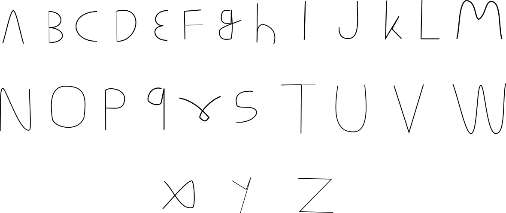

# Mouse Motion
Turn your mouse movements into text.

[](https://skillicons.dev)


## Description
The app uses a LSTM that classifies mouse movements read from the combined device file for all mice (`/dev/input/mice`).

It can work with both udev and eudev device filesystems.

The model has only been trained on with a mouse set at a dpi of 800. The dataset contains about 1000 training samples, and it is not balanced. Letter which were difficult for the model to classify have more samples than easier letters.

## Letters
The user can draw the letters using the mouse movements associated with the respective letters.



## User Permissions
The user needs to be in the input group to be able to read device files.
```
sudo usermod -aG input $USER
```
A restart is needed for these changes to take effect.

## Files included
- `dataset.json` : A dataset for testing whether model can recognise different letters. Too small with similar letters.

- `dataset2.json` : A dataset with carefully chosen shapes for each letter. 715 samples, unbalanced.

- `lstm.ipynb` : A training notebook for the model.

- `mouse.py` : Python script used to create the dataset.

- `test.py` : Python script to use the model and type letters.